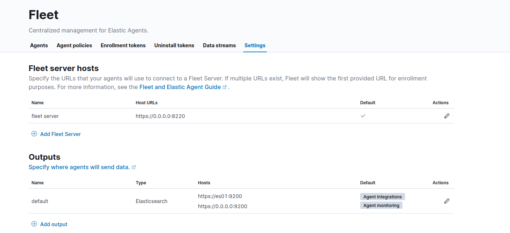

Increase /etc/sysctl.conf vm.max_map_count to at least 262144
```bash
sudo echo 'vm.max_map_count=262144' >> /etc/sysctl.conf && sudo sysctl -w vm.max_map_count=262144
```

```dotenv
# Password for the 'elastic' user (at least 6 characters)
ELASTIC_PASSWORD="kibana"

# Password for the 'kibana_system' user (at least 6 characters)
KIBANA_PASSWORD="kibana"

# Version of Elastic products
STACK_VERSION="8.11.3"

# Set the cluster name
CLUSTER_NAME="prod-paymeindia-elasticsearch-cluster"

# Set to 'basic' or 'trial' to automatically start the 30-day trial
LICENSE="basic"
#LICENSE="trial"

# Port to expose Elasticsearch HTTP API to the host
ES_PORT="9200"
#ES_PORT="127.0.0.1:9200"

# Port to expose Kibana to the host
#KIBANA_PORT="5601"
KIBANA_PORT="8001"

# Port to expose Fleet to the host
FLEET_PORT="8220"


# Port to expose APM to the host
APMSERVER_PORT="8200"

# Increase or decrease based on the available host memory (in bytes)
MEM_LIMIT="3000000000"

# Project namespace (defaults to the current folder name if not set)
COMPOSE_PROJECT_NAME="prod_paymeindia_elasticsearch"


# SAMPLE Predefined Key only to be used in POC environments
ENCRYPTION_KEY="c34d38b3a14956121ff2170e5030b471551370178f43e5626eec58b04a30fae2"


# APM Secret Token for POC environments only
ELASTIC_APM_SECRET_TOKEN="AAEAAWVsYXN0aWMvZmxlZXQtc2VydmVyL3Rva2VuLTE3MDI5MDEyOTg1Mjg6ZDhGNTV3QjZUWC1RVk1BejhwQVpJUQ"
```

###### Run the Elastic Stack
```bash
docker-compose up -d
```
First, we’ll need to pull the CA certificate from the cluster. This will be the same command we used in Part One:
```bash
docker cp es-cluster-es01-1:/usr/share/elasticsearch/config/certs/ca/ca.crt /tmp/.
```
Note: This command will be different based on either the directory you’re running the docker-compose.yml file from or the COMPOSE_PROJECT_NAME variable that is specified in the .env file.

Next, we will need to get the fingerprint of the certificate. For this, we can use an OpenSSL command:
```bash
openssl x509 -fingerprint -sha256 -noout -in /tmp/ca.crt | awk -F"=" {' print $2 '} | sed s/://g
```

This will produce a value similar to: 

5A7464CEABC54FA60CAD3BDF16395E69243B827898F5CCC93E5A38B8F78D5E72

Finally, we need to get the whole cert into a yml format. We can do this with a `cat` command or just by opening the cert in a text editor:
```bash
cat /tmp/ca.crt
```

Once you have the certificate text, we will add it to a yml format and input all this information into the Fleet Settings screen from earlier.

For “Hosts,” we will want to use “https://es01:9200”. This is because the container that hosts the Fleet server understands how to communicate with the es01 container to send data.

Input the fingerprint that was produced for the field “Elasticsearch CA trusted fingerprint.”

Finally, add the certificate text to the “Advanced YAML configuration.” Since this is a yml configuration, it will throw an error if not spaced correctly. 

Start with:

```bash
ssl:
  certificate_authorities:
  - |
```

And then paste the certificate text, making sure the indentation is correct.

Example:
https://static-www.elastic.co/v3/assets/bltefdd0b53724fa2ce/blt0fd5e8f5c53241e8/65256f40fbc4f6c0df9ae3af/Screenshot_2023-10-10_at_9.35.17_AM.png


